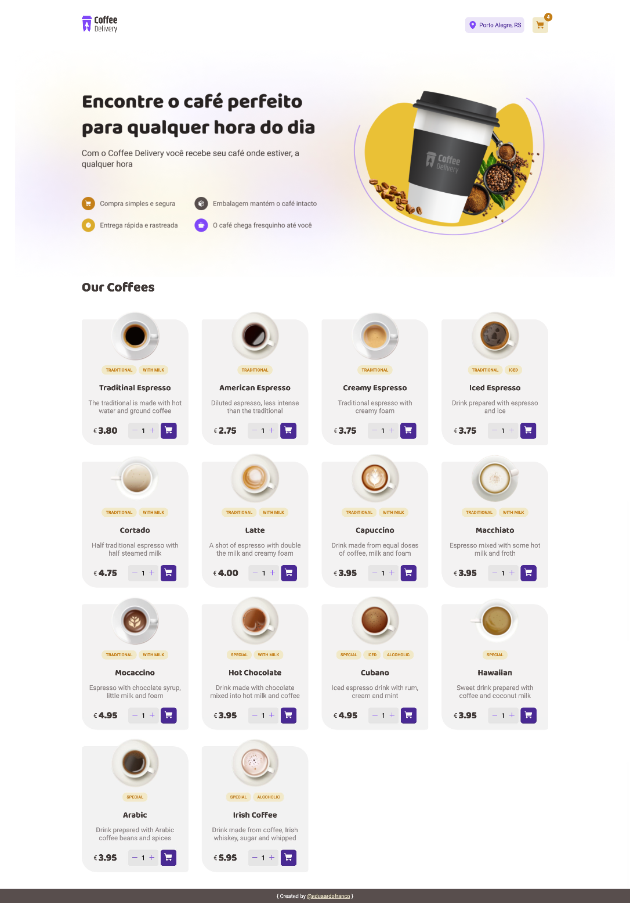
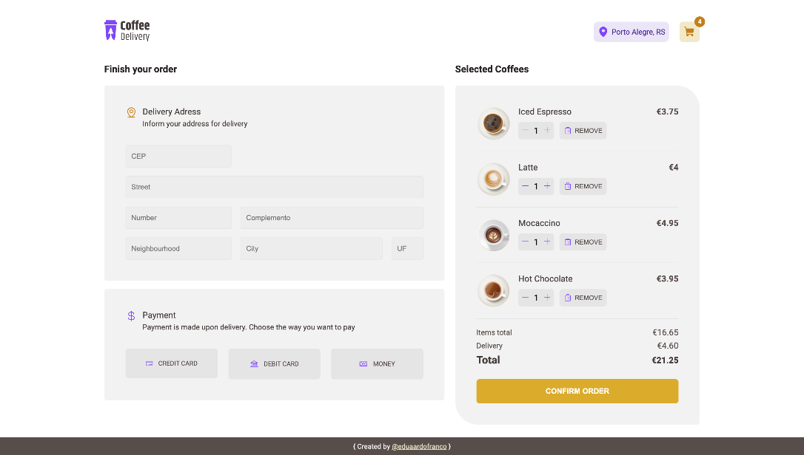
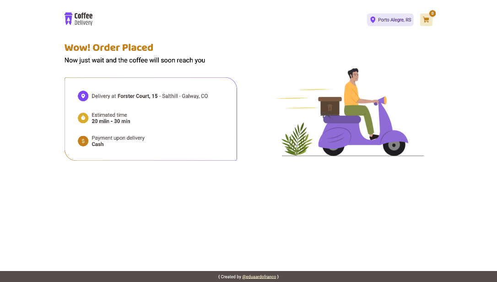

# Coffee Delivery - Online Coffee Ordering Interface

Coffee Delivery is a front-end interface for online coffee orders, allowing users to seamlessly browse and add their favorite coffee items to the cart before completing the order. Developed using React with TypeScript, the project employs the use of reducers to efficiently manage and handle application states.

### Key Features:

 - Browse and select from a variety of coffee options.
 - Add chosen items to the cart for a streamlined ordering experience.
 - Utilizes React and TypeScript for a robust and type-safe development environment.
 - State management through reducers ensures smooth handling of application states.
 - Form handling powered by React Hook Form for an efficient and performant approach.
 - Form validation implemented with Zod for robust and reliable input validation.

### Technologies Used:

React
TypeScript
Reducer (State Management)
React Hook Form (Form Handling)
Zod (Form Validation)

## Setup Instructions

### Clone the Repository:
```bash
git clone https://github.com/your-username/Coffee-Delivery.git
```

### Navigate to the Project Directory:
```bash
cd Coffee-Delivery
```
### Install Dependencies:
```bash
npm install

```

### Run the Project:
```bash
npm run dev

```

## Screenshots

### Home


### Cart


### Order Confirmation


